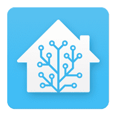

# Homeassistant info, examples and tips

This is my repository for reminding me how i did things regarding Homeassistant.  
If anyone is reading this, i may have not done things the conventional way, but... they worked for me.  
I am not a computer programmer in any way. Just a smart home enthusiast.  

I hope anyone who finds this repo makes use out of it.
I am trying to keep it up to date as much as possible and adding any new features or tips i come across.

## Installing HASSIO on Ubuntu
[Click Here](hassio_ubuntu_install_instructions.md) For installing hassio help

## Homeassistant config file examples
[Config Examples](hass_config_file_examples/config.yaml)  
[Automation Examples](hass_config_file_examples/automation.yaml)  
[Script Examples](hass_config_file_examples/script.yaml)  
[Theme Examples](hass_config_file_examples/themes.yaml)  

## Homeassistant lovelace card examples
[2 Horizontal Rows Of Vertical Buttons](lovelace_card_examples/2_horizontal_rows_of_vertical_buttons.yaml)  
[3 Gauges In A Horizontal Stack](lovelace_card_examples/3_gauges_in_a_horizontal_stack.yaml)  
[Camera Card With Entities](lovelace_card_examples/camera_card_with_entities.yaml)  
[Entity Card With Custom Separator](lovelace_card_examples/entity_card_with_custom_separator.yaml)  
[Mini Media Player](lovelace_card_examples/mini_media_player.yaml)  
[Round Pop Out Card](lovelace_card_examples/round_pop_out_card.yaml)  
[Sonarr Upcoming Media](lovelace_card_examples/sonarr_upcoming_media.yaml)  
[Timer Card](lovelace_card_examples/timer_card.yaml)  

## Tasmota Tips and rules
[Click Here](tasmota_info_and_help.md) For tasmota help

## Port forwarding in routers I have used
[Click Here](port_forwarding_in_routers/) For port forwarding examples

## Projects I have been Working on
Including step by step instruction how i accomplished the end result.  
[In Wall Multisensor](hass_projects/in_wall_multisensor/README.md)

## Acknowledgments
I would like to thank the following people for providing videos, help and tips regarding Homeassistant.  
Everything i know and learned was from these guys and many more.

* [Homeassistant](https://www.home-assistant.io/) Here is a link the Homeassistant website
* [Franck Nijhof](https://github.com/frenck) Here is a link to his Github page
* [DrZzs](http://drzzs.com/) Here is a link to the docs website
* [The Hookup](http://www.thesmarthomehookup.com/) Here is a link to Robs website
* [Digiblur](https://www.digiblur.com/) Here is a link to Travis website
* [Hasscasts](https://www.youtube.com/channel/UCGOCeqMJnLvr-5C-ypUw7IQ/featured) Here is a link to his youtube channel
* [BurnsHa](https://www.youtube.com/channel/UCSKQutOXuNLvFetrKuwudpg) Here is a link to his youtube channel  

When purchasing components and sensors, consider [Banggood](https://www.banggood.com/index.php?zf=24584579) They have great prices and quick shipping times.

