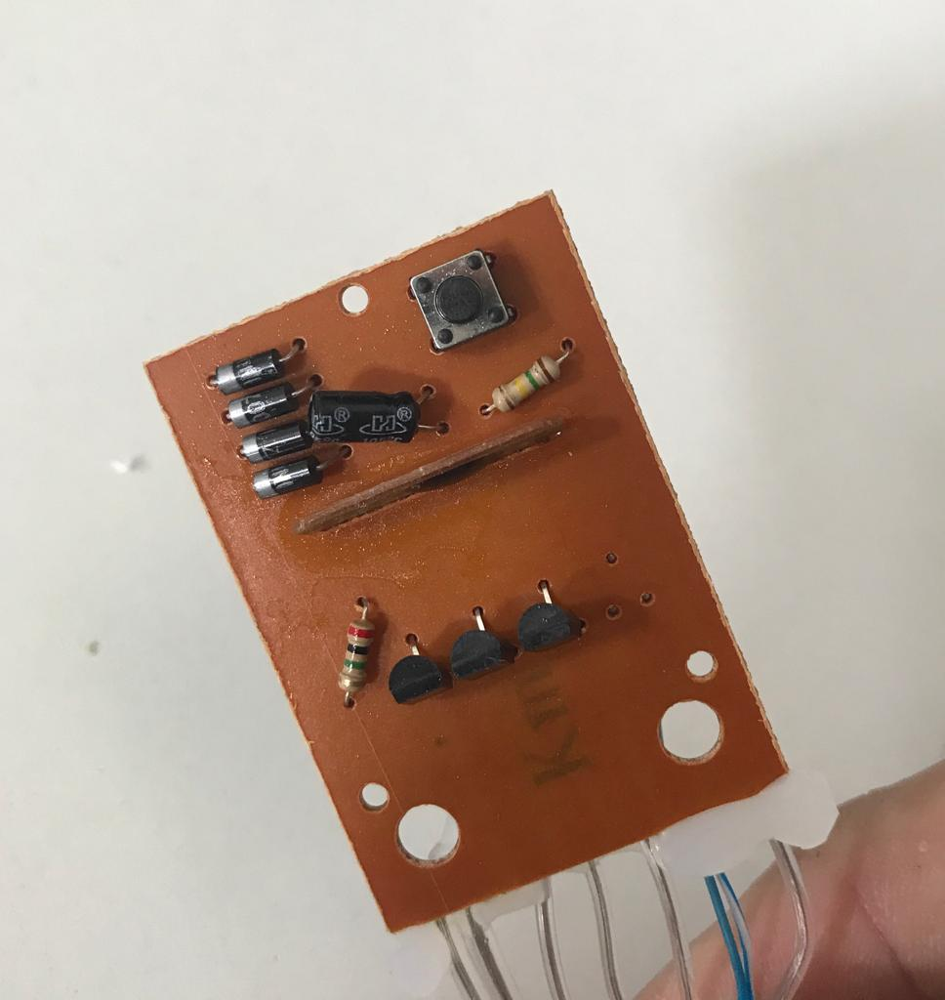
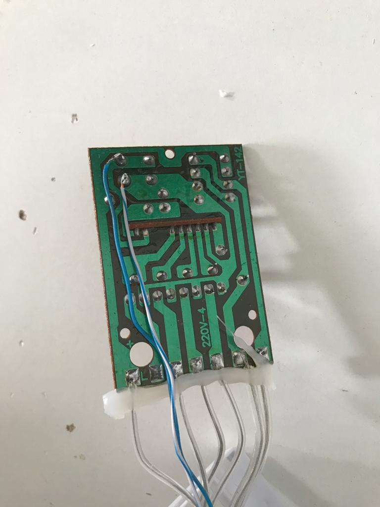

# Homeassistant Christmas Tree Lights
How to make any standard, dumb christmas tree lights smart.  
I have done this using a D1 Mini and relay because the lights have a contoler that cycles through effects. to make use of these effects we need to simulate pressing the button on the controler to cycle through the different options.  
The realy will go on and off within 300 miliseconds simulating the press of the button. We do this using rules in tasmota. (More info below)
While i had a D1 Mini in there i decided to use a 2 channel relay and also power the lights with that instead of using a smart plug or sonoff.  

## Purchase the components needed
Below are links to the devices i used.
[D1 Mini](https://www.banggood.com/custlink/Gm3KgKZrD4)  
[2 Channel Relay](https://www.banggood.com/custlink/K3mveKON0G)
[Dupont Junper Cables](https://www.banggood.com/custlink/vDvD6DjOQt)

  

### The Main Build  
Lets build the project. Follow the steps below to recreate what i have.

  
* First take the controler apart and inspect the PCB.  
You need to locate the button that you press to cycle through the effets.  
using the continuity feature of a multimeter, find 2 pins that make contact when the button is pressed.  

  


### Flash Your D1 Mini With Tasmota
Because tasmota is the best! Every esp8266 chip should have tasmota.
[Click Here](https://www.youtube.com/watch?v=OfSbIFIJPuc) for a video tutorial on how to flash the Sonoff RF Bridge.  
*The video is owned and created by DrZzs Check out his [website](http://drzzs.com/) and [youtube channel](https://www.youtube.com/channel/UC7G4tLa4Kt6A9e3hJ-HO8ng) for more great tutorials. If you like what he's doing consider [becoming one of his patrons](https://www.patreon.com/DrZzs/overviewbuying) to thank him for all of his hard work*


```
binary_sensor:
  - platform: mqtt
    state_topic: "tele/sonoffrf/RESULT"
    value_template: '{{value_json.RfReceived.Data}}'
    payload_on: "D9DFA6"
    payload_off: "OFF"
    off_delay: 3
    name: "Smoke Alarm"
    device_class: smoke
```

