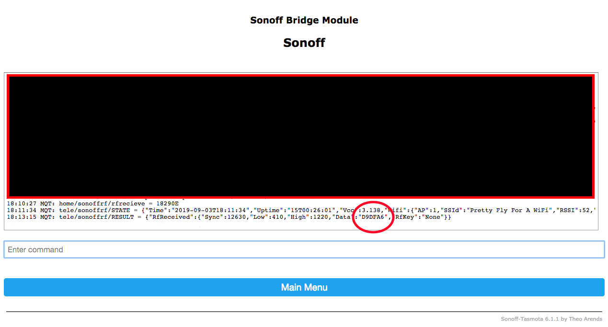
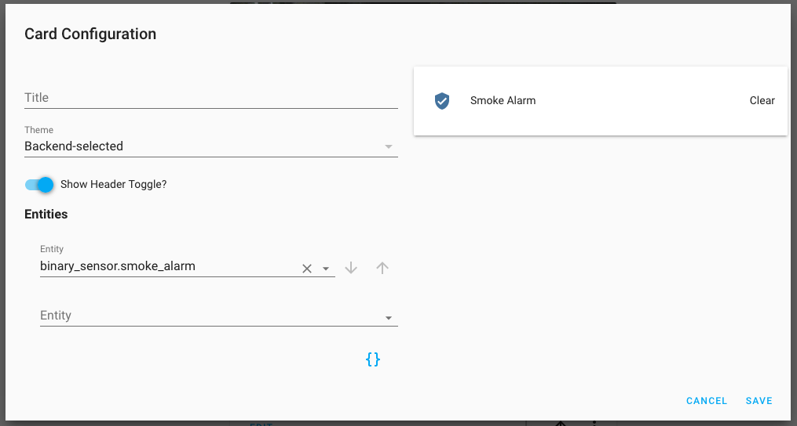

# Homeassistant Smoke Detector
A conventional smoke detector with a high pitched sound when triggered. With the additional bonus of notifying you when the sensor gets triggered and also switching on lights in the home for clear visibility ready for a safe exit. As i have a smart electric door lock, that also get unlocked.

## Purchase the components needed
Below are links to the devices i used. You can use a different smoke alarm as long as it transmits a 433Mhz signal when triggered.  
[433MHz Wireless Smoke Detector](https://www.banggood.com/custlink/vvDm03SCJy)  
[SONOFF RF Bridge](https://www.banggood.com/custlink/DGDv0K9Jvc)


### Flash Your sonoff RF Bridge with tasmota
Because tasmota is the best! Every esp8266 chip should have tasmota.
[Click Here](https://www.youtube.com/watch?v=OfSbIFIJPuc) for a video tutorial on how to flash the Sonoff RF Bridge.  
*The video is owned and created by DrZzs Check out his [website](http://drzzs.com/) and [youtube channel](https://www.youtube.com/channel/UC7G4tLa4Kt6A9e3hJ-HO8ng) for more great tutorials. If you like what he's doing consider [becoming one of his patrons](https://www.patreon.com/DrZzs/overviewbuying) to thank him for all of his hard work*

### Find out the RF code for your alarm.
Every device will have a different code. The example below is mine. Yours will be different so **please don't skip this part.**  
Log into the RF bridge web ui and go into the console. Press the test button for 3 seconds until you hear the beep. the RF code for your device will show up in the console.


### Set up the alarm in Homeassistant
Add the following to the binary_sensor section of your configuration.yaml file  
```
binary_sensor:
  - platform: mqtt
    state_topic: "tele/sonoffrf/RESULT"
    value_template: '{{value_json.RfReceived.Data}}'
    payload_on: "D9DFA6"
    payload_off: "OFF"
    off_delay: 3
    name: "Smoke Alarm"
    device_class: smoke
```
as the alarm doesn't have a 2nd code for no smoke detected. The off payload can be anything you like, just add the `off_delay` to switch the entity off after 3 seconds in my example.  
the `state_topic: "tele/sonoffrf/RESULT"` in my example is this because i made the MQTT topic `sonoffrf` if you chose something else remember to make it the same.  
Once you have added the alarm as a binary sensor, restart homeassistant. I added the alarm as an entity in lovelace and tested it by pressing the test button on the alarm. The entity showed as `detected` for 3 seconds then went back to `clear` Everything is working correctly.



### Create a group of lights
These will be the lights you want to turn on during your **fire exit**  
Add the following to your groups.yaml file
```
fire_exit:
  name: Fire Exit Lights
  icon: mdi:lightbulb
  entities:
    - switch.hall_1
    - switch.hall_2
    - switch.garage
    - switch.landing
    - switch.bedroom
    - switch.living_room
    - switch.front_yard
```
You will need to change the entities to suit your homeassistant entities.

### Create the automation
```
- alias: Smoke Alarm Automation
  initial_state: true
  trigger:
    - entity_id: binary_sensor.smoke_alarm
      from: 'off'
      platform: state
      to: 'on'
  action:
    - service: notify.notify
      data:
        message: Your smoke alarm has been set off. Please investigate.
    - entity_id: group.fire_exit
      service: homeassistant.turn_on
    - data:
        entity_id: switch.garage_door_lock
      service: switch.turn_off
```
The `notify.notify` will send a notification to all my ios devices with the homeassistant app installed and signed in.  
If you are an android user, **i cant help with notifications.** I don't have any android devices to try!
the `state_topic: "tele/sonoffrf/RESULT"` in my example is this because i made the MQTT topic `sonoffrf` if you chose something else remember to make it the same.


## Restart homeassistant and Thats it! Have fun trying it for yourself.

# Share the love  
If you found this information helpful please consider [buying me a coffee](https://www.buymeacoffee.com/geekyclarkey)  
Thank you.  
