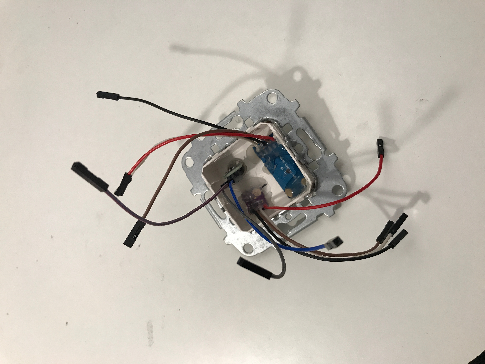
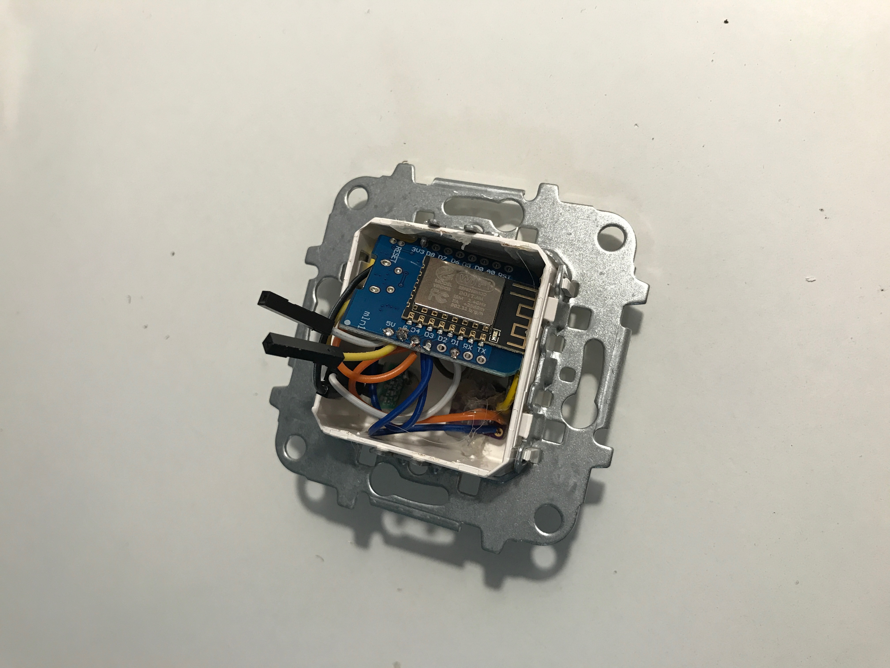

# Homeassistant In Wall Multisensor

## Purchase all the sensors and components needed
[D1 Mini](https://banggood.app.link/DMaosBzjDZ)  
[BH1750FVI Digital Light Intensity Sensor](https://banggood.app.link/8EDHRH6iDZ)  
[Mini IR Infrared Pyroelectric PIR](https://banggood.app.link/Tg1R2iFjDZ)  
[HTU21D Temperature Humidity Sensor](https://banggood.app.link/6JE5LxJjDZ)  
[5V AC-DC Power Supply](https://banggood.app.link/yqQWaiOjDZ)  
[Jumper Cable Dupont Wires](https://banggood.app.link/BBVZeTXjDZ)  

## Hardware
### Step 1
solder small dupont cables onto the sensors and strip the ends.    
solder onto the 3.3v, Ground, SDA and SCL. I used the same color cables for each pin.  
The PIR Sensor uses push on cables, just strip the ends.  
  
*In this image the temp sensor is the GY-SHT30-D SHT30 3.3V Digital Temperature and Humidity Sensor Module. The software setup uses the HTU21D Temperature Humidity Sensor. I have used both. Both work perfectly.*

### Step 2
Flash The D1 Mini With the latest version of tasmota.  
[Click Here](https://github.com/arendst/Sonoff-Tasmota/wiki/Flashing) for instructions on how to flash D1 mini and Node MCU Devices.

### Step 3
Once Flashed and you have the dupont cables soldered, You need to glue the sensors in place.  
I used 5mm holes for the lux and temp sensors and 10.5mm for the mini PIR


### Step 4
solder the wires to the D1 mini.
If you use the same GPIO pins i used you can follow the software instructions but if you use different pins, make sure you set up the correct pins in the tasmota.  
* 3.3V - 3.3
* Ground - GND
* SCL - D4
* SDA - D3
* PIR Data Pin - D1



### Step 5
Solder cables onto the 5V pin and add another to the ground pin for the power supply  


### Thats it for the hardware!


## software

Using the tamota user interface  
Click on Configuration, Configure Module.  
Change the module type to 'Generic (18)'  
Then set the pins as follows:  
D3 - I2C SDA  
D4 - I2C SCL  
D1 - Switch1  
Click Save at the bottom.  


Set up MQTT with your username, password, server and topic.  
Remeber the topic has to be unique for every MQTT device.  


### Setting up rules etc.
Go into the tasmota console and type:  
`Switchmode1 1` This will make the pir state 1 and 0 instead of on and off.  

Next

`Rule1 on switch1#state do publish multisensor/pir %value% endon`  
Switch on the rule by typing  
`Rule1 1`  

You will need to change 'multisensor' in the rule to something unique for every sensor you make

## Homeassistant

Add these to your configuration.yaml:
```
sensor:
  - platform: mqtt
    name: "Multisensor Brightness"
    state_topic: "tele/multisensor/SENSOR"
    value_template: "{{ value_json['BH1750'].Illuminance }}"
    unit_of_measurement: 'lx'
  - platform: mqtt
    name: "Multisensor Temperature"
    state_topic: "tele/multisensor/SENSOR"
    value_template: "{{ value_json['HTU21'].Temperature }}"
    unit_of_measurement: '°C'
  - platform: mqtt
    name: "Multisensor Humidity"
    state_topic: "tele/multisensor/SENSOR"
    value_template: "{{ value_json['HTU21'].Humidity }}"
    unit_of_measurement: '%'
```
```
binary_sensor:
  - platform: mqtt
    state_topic: "multisensor/pir"
    payload_on: "1"
    payload_off: "0"
    name: "Multisensor PIR"
    device_class: motion
```
Restart homeassistant and add the new entities into your lovelace interface

Thats it! Have fun trying it for yourself.
