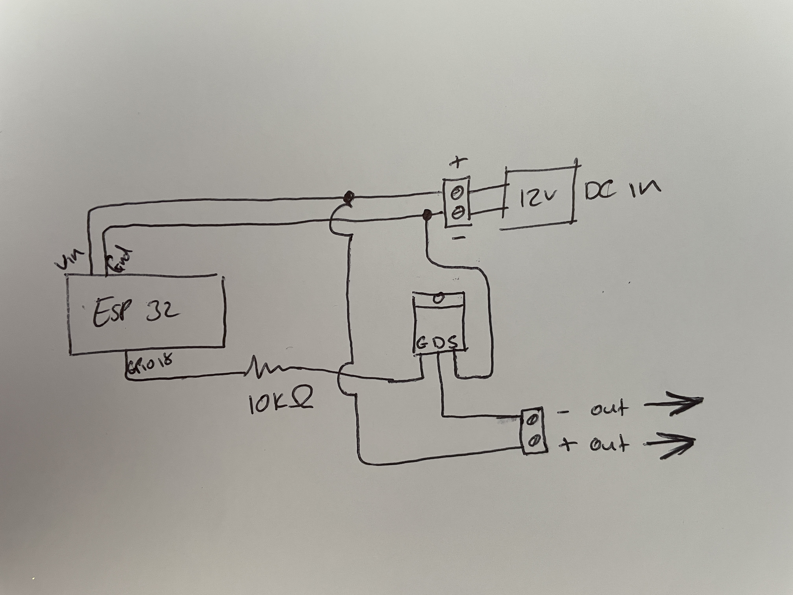
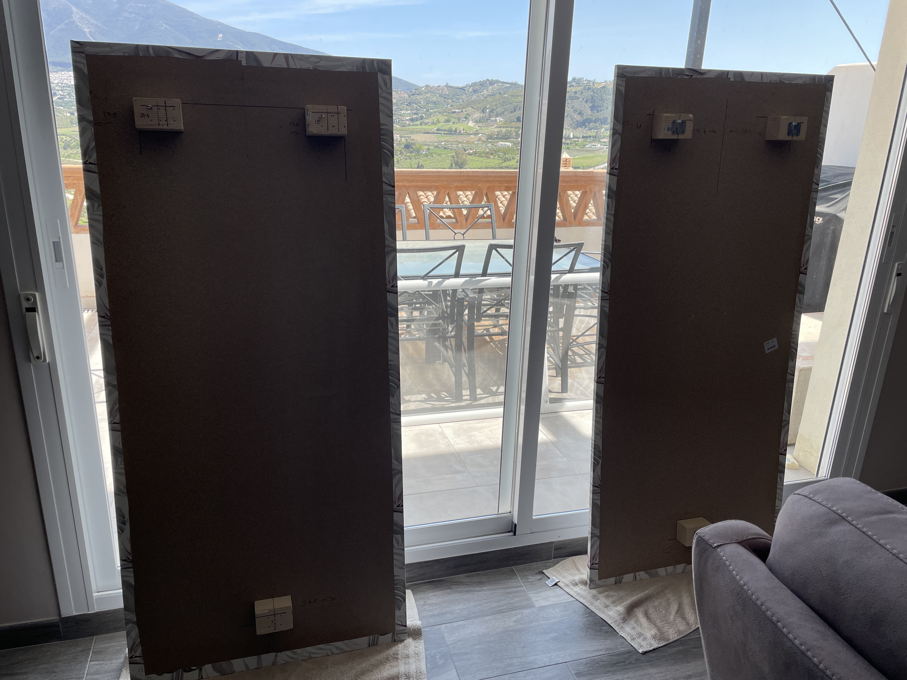

# LED Wall panels for my media wall

## Purchase all the sensors and components needed
[esp32](https://www.banggood.com/custlink/Gm3KgKZrD4)   
[Pack of resistors](https://www.banggood.com/custlink/Gm3KgKZrD4)  
[N-channel MOSFETs](https://www.banggood.com/custlink/Gm3KgKZrD4)  
[12v power supply](https://www.banggood.com/custlink/Gm3KgKZrD4)  
[12v LED Strips](https://www.banggood.com/custlink/Gm3KgKZrD4)  
Wood and wallpaper can be purchased from your local DIY store.  

### Step 1
i started by using some project board and soldering on the gpio ins so the esp32 can be easily replaced if necessary.  
I also used screw terminals for the wires and soldered wires to the necessary pins.   
     
*Its not in the previous pictures but i added screw terminals for a push button switch thats placed on my wall to toggle the lights on and off.*

### Step 2
Flash The esp32 With the ESPHome config.  
The code i used is below:     
```
substitutions:
  espname: "mediawalllights"
  placename: "Media Wall"
  hostname: "Lights"
  ssid: "your_wifi_ssid"
  ssidpassword: "your_wifi_password"

esphome:
  name: $espname
  platform: ESP32
  board: esp-wrover-kit

wifi:
  ssid: $ssid
  password: $ssidpassword
  fast_connect: true
  ap:
    ssid: $espname
    password: "1234567890"

captive_portal:
logger:
api:
ota:

output:
  - platform: ledc
    pin: GPIO18
    id: pwm_gpio
    frequency: 100Hz
    zero_means_zero: True

light:
  - platform: monochromatic
    output: pwm_gpio
    id: pwm_light
    name: $placename
    #default_transition_length: 700ms
    effects:
      - flicker:
      - random:
      - pulse:
      - pulse:
          name: "Fast Pulse"
          transition_length: 0.5s
          update_interval: 0.5s
      - pulse:
          name: "Slow Pulse"
          # transition_length: 1s      # defaults to 1s
          update_interval: 2s
      - strobe:

switch:
  - platform: restart
    name: Restart $placename $hostname

binary_sensor:
  - platform: gpio
    pin:
      number: GPIO13
      mode: INPUT_PULLUP
      inverted: true
    name: $hostname Button
    internal: true
    on_click:
      - min_length: 70ms
        max_length: 500ms
        then:
          - light.toggle: pwm_light
```

### Step 3
Essentially you need to connect the + of your 12v power supply to the VIN pin of the esp32 and also to the + output to the LEDs.  
The - of your 12v power supply goes to the GND of the esp32 and the source of the MOSFET.  
GPIO18 of the esp32 goes to the gate of the MOSFET with a 10k resistor between.  
then the drain of the MOSFET goes to the - output to the LEDs.  
Here is a badly drawn schematic.


### Step 4
Once all everything is connected it should work and you should be able to control the power and brightness in homeassistant.  
*If you drop the brightness down below 10% they go off completely.*  
   

### Step 5
Next i built the panels by adding some 5cm standoffs to the back of pieces of chipboard.  
    

### Step 6
When i built the media wall i ran tubes to the centre in preparation for the led power cables.  
  

### Step 7
Quick position test to make sure they fit nicely and are both level.  
   

### Step 8
I took the boards back off to install the led strips to the back of each board.  
  

### Step 9
I ran the LEDS 4-5cm from the edge of the panel from the top centre all the way around using the adhesive on the LED strips
and some staples to hold them in place more permanently.  
   

### Step 10
After mounting the panels and wiring up the LEDs, I put the power supply and the esp32 into an electrical box that sits inside the media wall.
 

## And here it is!
 
