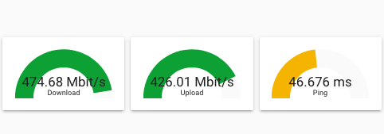

# 3 Graphs in a horizontal row



```
name: Speed Test
type: horizontal-stack
cards:
  - cards:
      - entity: sensor.speedtest_download
        min: 0
        max: 500
        severity:
          green: 400
          yellow: 250
          red: 100
        theme: default
        type: gauge
        name: Download
    type: horizontal-stack
  - cards:
      - entity: sensor.speedtest_upload
        min: 0
        max: 500
        severity:
          green: 400
          yellow: 250
          red: 100
        theme: default
        type: gauge
        name: Upload
    type: horizontal-stack
  - cards:
      - entity: sensor.speedtest_ping
        min: 0
        max: 100
        severity:
          green: 1
          yellow: 40
          red: 90
        theme: default
        name: Ping
        type: gauge
    type: horizontal-stack
```
