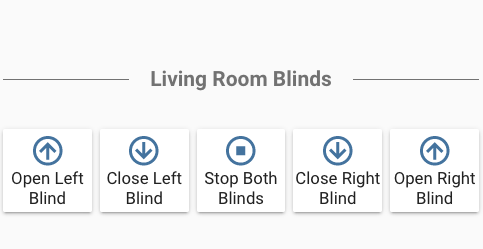

# Entity card with custom separator



```
cards:
  - text: Living Room Blinds
    type: 'custom:text-divider-row'
  - cards:
      - entity: switch.open_left_blind
        icon: 'mdi:arrow-up-circle-outline'
        name: Open Left Blind
        tap_action:
          action: toggle
        type: entity-button
      - entity: switch.close_left_blind
        icon: 'mdi:arrow-down-circle-outline'
        name: Close Left Blind
        tap_action:
          action: toggle
        type: entity-button
      - entity: script.stop_blinds
        icon: 'mdi:stop-circle-outline'
        name: Stop Both Blinds
        tap_action:
          action: toggle
        type: entity-button
      - entity: switch.close_right_blind
        icon: 'mdi:arrow-down-circle-outline'
        name: Close Right Blind
        tap_action:
          action: toggle
        type: entity-button
      - entity: switch.open_right_blind
        icon: 'mdi:arrow-up-circle-outline'
        name: Open Right Blind
        tap_action:
          action: toggle
        type: entity-button
    type: horizontal-stack
type: vertical-stack

```
