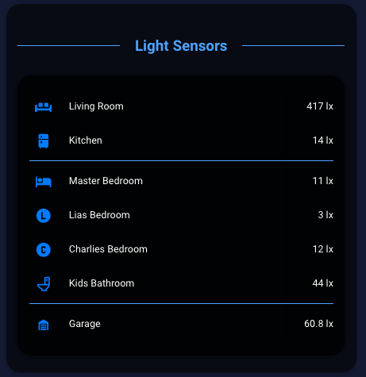

# Entity card with custom separator

  

To accomplish this you need to have the following custom plugins installed and added to you're lovelace resources:  
[text divider row](https://github.com/custom-cards/text-divider-row)  
[Vertical Stack In Card](https://github.com/ofekashery/vertical-stack-in-card)  

```
entities:
  - text: Light Sensors
    type: 'custom:text-divider-row'
  - cards:
      - entities:
          - entity: sensor.living_room_brightness
            icon: 'mdi:sofa'
            name: Living Room
          - entity: sensor.kitchen_brightness
            icon: 'mdi:fridge'
            name: Kitchen
          - type: divider
          - entity: sensor.bedroom_brightness
            icon: 'mdi:hotel'
            name: Master Bedroom
          - entity: sensor.lias_room_brightness
            icon: 'mdi:alpha-l-circle'
            name: Lias Bedroom
          - entity: sensor.charlies_room_brightness
            icon: 'mdi:alpha-c-circle'
            name: Charlies Bedroom
          - entity: sensor.kids_bathroom_brightness
            icon: 'mdi:toilet'
            name: Kids Bathroom
          - type: divider
          - entity: sensor.garage_lux
            icon: 'mdi:garage'
            name: Garage
        type: entities
    type: 'custom:vertical-stack-in-card'
type: entities
```
