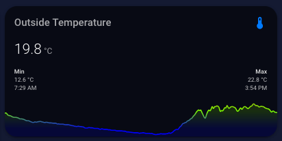

# Mini Graph Card

  

To accomplish this you need to have the following custom plugin installed and added to you're lovelace resources:  
[Mini Graph Card](https://github.com/kalkih/mini-graph-card)   

```
color_thresholds:
  - color: '#c0392b'
    value: 28
  - color: '#7cfc00'
    value: 20
  - color: '#0000ff'
    value: 15
entities:
  - entity: sensor.outside_temperature
font_size: 70
height: 65
hours_to_show: 24
line_width: 2
points_per_hour: 10
show:
  extrema: true
  fill: true
  labels: false
type: 'custom:mini-graph-card'
```
